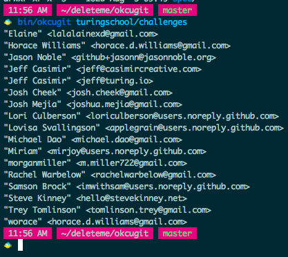

Okcugit
=======

My solutions for [okcugit](https://github.com/turingschool/challenges/blob/master/ok_cugit.markdown).

License
-------

[Just do what the fuck you want to.](http://www.wtfpl.net/about/)
